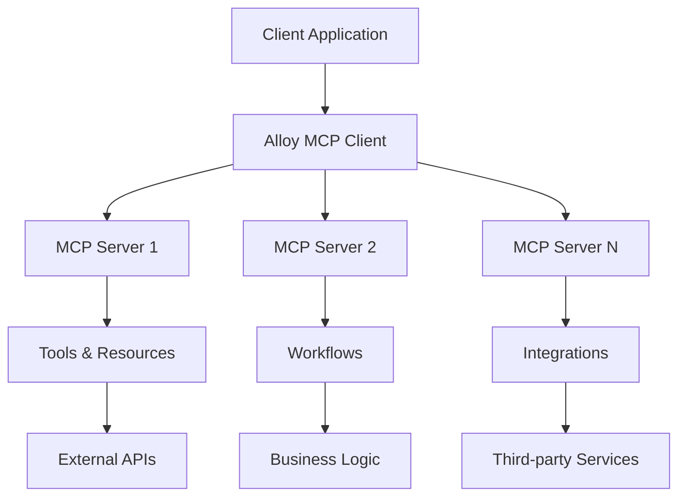

# Alloy MCP Examples

A comprehensive collection of examples demonstrating how to integrate and use Alloy's Model Context Protocol (MCP) servers in various applications and frameworks.

## 🚀 Quick Start

```bash
# Clone the repository
git clone https://github.com/alloy-automation/mcp-examples
cd mcp-examples

# Install dependencies
pnpm install

# Copy environment variables (already pre-configured!)
cp .env.example .env

# All examples use a single .env file from the root
```

## 📚 Examples

### 1. [Basic TypeScript](./examples/basic-typescript)

A minimal example showing how to connect to Alloy MCP servers using TypeScript.

**Features:**

- Basic server connection
- Tool discovery and invocation
- Error handling
- Response streaming

```bash
pnpm run example:basic
```

### 2. [Next.js Chat Application](./examples/nextjs-chat)

A full-featured chat application built with Next.js and Alloy MCP.

**Features:**

- Real-time chat interface
- Multiple MCP server support
- Tool execution visualization

```bash
cd examples/nextjs-chat
pnpm install
pnpm dev
```

### 3. [Python SDK](./examples/python-sdk)

Python implementation for Alloy MCP integration.

**Features:**

- Python MCP client
- Async/await support
- Tool discovery
- Workflow execution

```bash
cd examples/python-sdk
pip install -r requirements.txt
python main.py
```

## 🏗️ Architecture



## 🔧 Configuration

All examples use a **centralized configuration** from the root `.env` file. This simplifies setup and ensures consistency across all examples.

### Environment Variables

The project uses these pre-configured values:

```bash
# Root .env file (used by all examples)
ALLOY_API_KEY=<your_api_key_here>
ALLOY_SERVER_URL=https://mcp.runalloy.com
MCP_SERVER_URL=<your_mcp_server_url>
MCP_ACCESS_TOKEN=<your_mcp_access_token>
```

## 🤝 Contributing

We welcome contributions!

1. Fork the repository
2. Create your feature branch (`git checkout -b feature/amazing-feature`)
3. Commit your changes (`git commit -m 'Add amazing feature'`)
4. Push to the branch (`git push origin feature/amazing-feature`)
5. Open a Pull Request

## 📝 License

This project is licensed under the MIT License - see the [LICENSE](LICENSE) file for details.

## 🔗 Resources

- [Alloy Documentation](https://docs.runalloy.com/)
- [MCP Specification](https://modelcontextprotocol.io)

## 💬 Support

- **Issues**: [GitHub Issues](https://github.com/alloy-automation/mcp-examples/issues)

---

Built with ❤️ by the Alloy team
